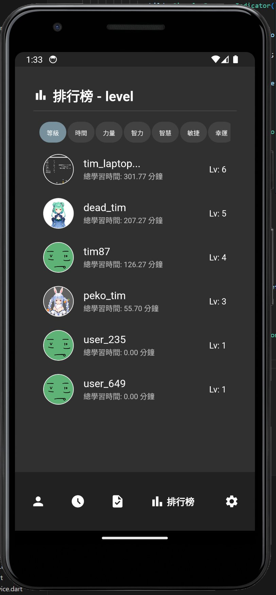
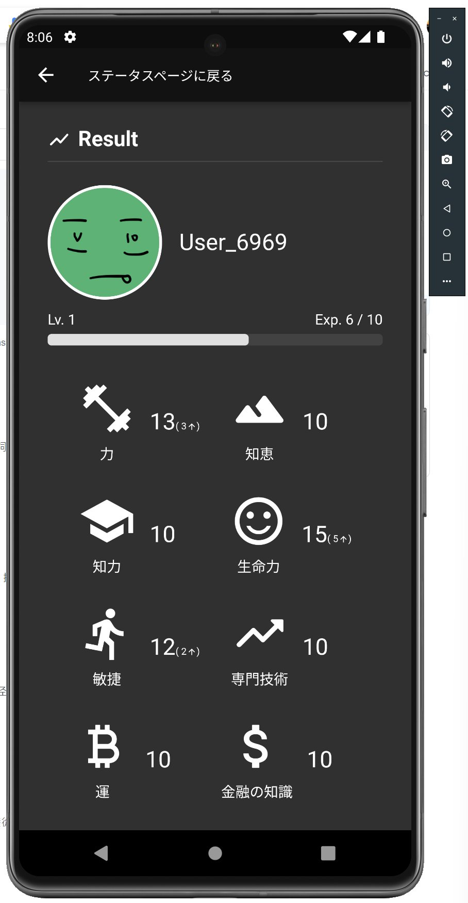
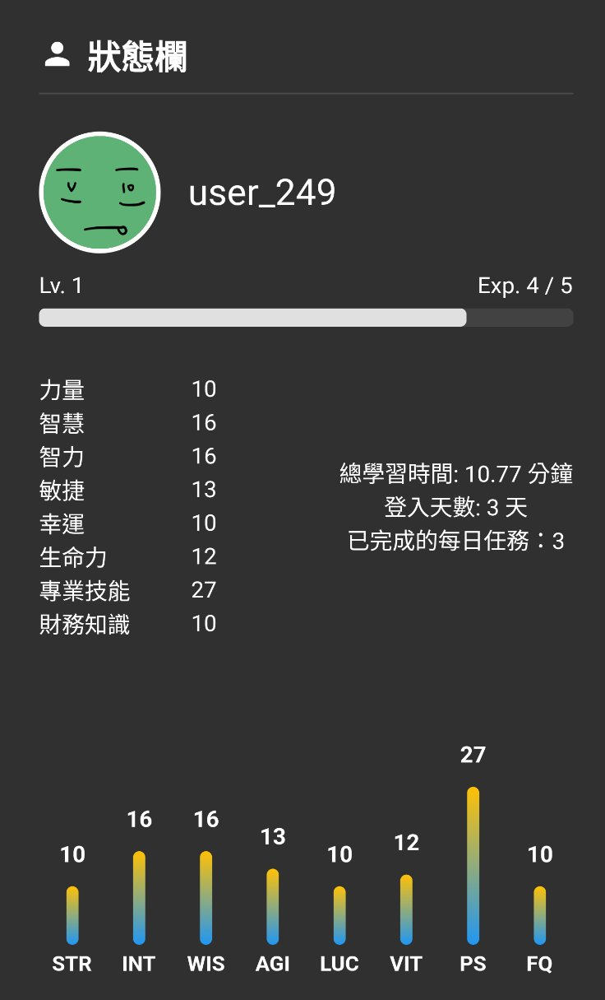

# Level - 多功能生活管理應用

這是一個使用 Flutter 開發的現代化生活管理應用程式，提供多種實用功能來幫助用戶更好地管理日常生活。

## 功能特點

- 📱 跨平台支援：支援 Android、iOS、Web、Windows、Linux 和 macOS
- 🔐 用戶認證：支援 Google 登入和 Firebase 認證
- 📊 數據視覺化：使用圖表和熱力圖展示數據
- 🌐 多語言支援：內建國際化功能
- 🔔 推送通知：整合 Firebase Cloud Messaging
- 💾 本地存儲：使用 Hive 進行高效能的本地數據存儲
- 📅 日曆功能：整合日曆視圖和熱力圖
- 🛍️ 應用內購買：支援應用內購買功能
- 📸 圖片處理：支援圖片選擇和上傳
- 🎨 現代化 UI：使用 Material Design 和自定義動畫

## 主要頁面介紹

### 1. 主頁面
主頁面提供了一個直觀的儀表板，讓用戶可以快速查看重要資訊：
- 今日待辦事項
- 重要通知提醒
- 快速操作按鈕
- 個人進度追蹤

### 2. 數據分析頁面
提供詳細的數據視覺化分析：
- 使用圖表展示各項數據趨勢
- 提供多維度的數據分析
- 支援自定義時間範圍
- 數據匯出功能

### 3. 日曆管理頁面
整合日曆和任務管理功能：
- 月曆視圖顯示所有重要事件
- 支援事件新增和編輯
- 提供熱力圖顯示活動頻率
- 支援多種日曆視圖切換

### 4. 個人設定頁面
提供完整的個人化設定選項：
- 帳號管理
- 通知設定
- 主題切換
- 語言選擇
- 隱私設定

### 5. 成就系統頁面
激勵用戶持續使用和進步：
- 顯示個人成就徽章
- 進度追蹤
- 獎勵系統
- 社交分享功能

## 應用程式截圖

<div align="center">
  
  
  
</div>

<div align="center">
  
  
  
</div>

## 技術架構

- Flutter SDK: >=3.1.3 <4.0.0
- 狀態管理：Provider
- 本地存儲：Hive
- 後端服務：Firebase
- 圖表庫：fl_chart
- 日曆組件：table_calendar
- 其他重要依賴：請參考 pubspec.yaml

## 安裝說明

1. 確保已安裝 Flutter SDK 和相關依賴
2. 克隆專案：
   ```bash
   git clone [專案網址]
   ```
3. 安裝依賴：
   ```bash
   flutter pub get
   ```
4. 運行專案：
   ```bash
   flutter run
   ```

## 開發指南

- 使用 `flutter pub run build_runner build` 生成必要的程式碼
- 遵循專案中的程式碼規範和 lint 規則
- 確保在提交前運行測試

## 版本資訊

當前版本：1.3.0+6

## 授權

[授權類型] - 查看 LICENSE 檔案了解更多資訊

## 貢獻指南

歡迎提交 Issue 和 Pull Request 來幫助改進這個專案。

## 聯絡方式

如有任何問題或建議，請通過以下方式聯絡：
[聯絡資訊]
